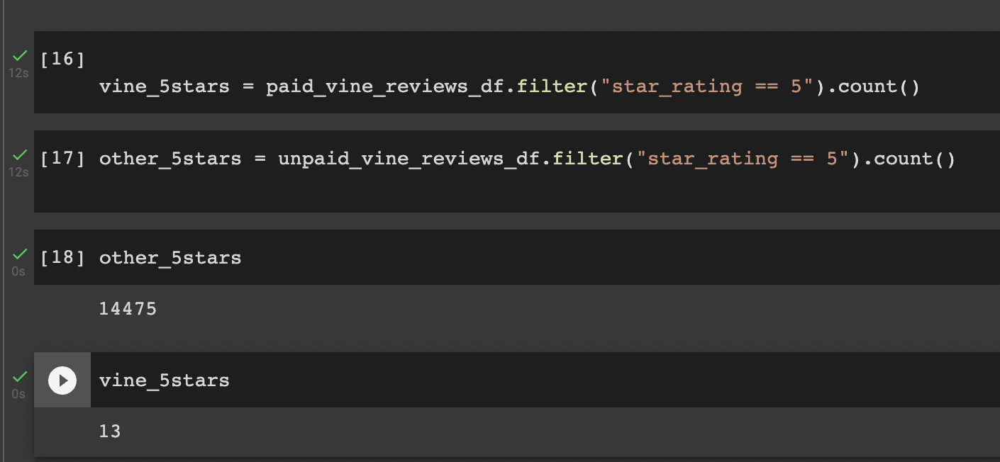

# Amazon_Vine_Analysis

Analyzing Amazon reviews written by members of the paid Amazon Vine program. The Amazon Vine program is a service that allows manufacturers and publishers to receive reviews for their products. Companies like SellBy pay a small fee to Amazon and provide products to Amazon Vine members, who are then required to publish a review.

PySpark to perform the ETL process to extract the dataset, transform the data, connect to an AWS RDS instance, and load the transformed data into pgAdmin.We will use PySpark, Pandas, or SQL to determine if there is any bias toward favorable reviews from Vine members in your dataset. 

## Results
 
* This is vine dataset we are working with 

 

  

* How many Vine reviews and non-Vine reviews were there? For the Shoes dataset:

Paid Vine Reviews - 22

Unpaid Vine Reviews - 26987

 

* How many Vine reviews were 5 stars? How many un Paid reviews were 5 stars? For the Shoes dataset:

Paid Vine Reviews that were 5-stars = 13

Un Paid Reviews that were 5-stars = 14475

 

* What percentage of Vine reviews were 5 stars? What percentage of Un-Vine reviews were 5 stars? For the Shoes dataset:

Vine Reviews that were 5-stars percentage = 59.09%

Unpaid-Vine Reviews that were 5-stars = 53%

 

## Summary

Summary: In my opinion there is no positivity bias for reviews in the Vine program. At first glance, it appeared that there would be bias; however after further analysis, it indicates that there are more non-members entering the reviews than Vine members. As a marketing strategy, we may want to know why don't more Vine members provide a review and how to increase the 5-star rating. We may want to provide incentives for the Vine members to provide more reviews and increase ratings. Or reach out to Non-members to provide a membership on a trial period. Then, provide one additional analysis that you could do with the dataset to support your statement, I think I would like to analyze the number of years a member has been a Vine member. It is possible that they are satisfied with the service but feel that they do not need to offer a review. I would like to analyze the number of purchases a member has made or the amount of the purchase in a given year. We may need to reach out to the loyal customers for process improvement or incentive for a loyalty program.

For this assignment I ended up doing  Pyspark due to the percentage calculation.